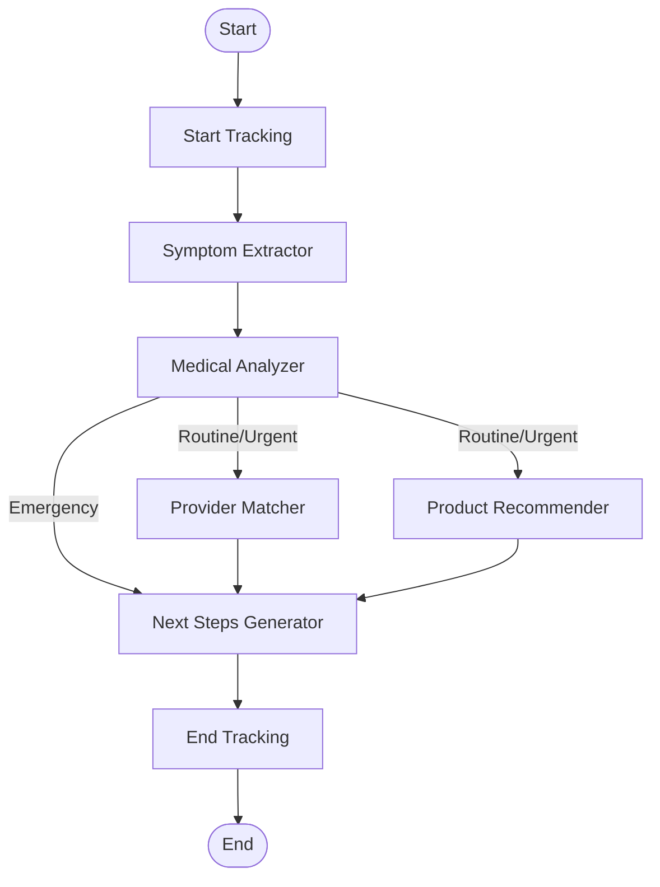

# LangGraph Assessment Orchestrator

This directory contains the LangGraph-based multi-agent orchestration system for AI-powered health assessment generation.

## Architecture

The orchestrator coordinates five specialized AI agents in a workflow that processes conversation history and generates comprehensive health assessments.

### Workflow Structure



## Components

### 1. State Annotation (`state.js`)
Defines the shared state structure that flows through the workflow:
- **Input fields**: conversationId, userId, messages, userLocation
- **Agent outputs**: symptoms, urgency, condition, providers, products, nextSteps
- **Metadata**: execution time, token usage, errors, retry counts

### 2. Workflow Definition (`workflow.js`)
Implements the LangGraph workflow with:
- **Sequential execution**: Symptom Extractor → Medical Analyzer
- **Conditional routing**: Emergency cases skip to next steps; routine/urgent cases execute provider and product search in parallel
- **Error handling**: Automatic retry logic (up to 2 retries) with exponential backoff
- **Performance tracking**: Execution time and token usage monitoring

### 3. Orchestrator Class (`index.js`)
Main entry point providing:
- `generateAssessment(initialState)`: Execute the complete workflow
- `validateInitialState(state)`: Validate input before execution
- `getVisualization()`: Get Mermaid diagram of the workflow

## Agent Nodes

### Symptom Extractor Node
- Extracts structured symptom data from conversation messages
- Classifies urgency (routine, urgent, emergency)
- Detects red flag symptoms

### Medical Analyzer Node
- Diagnoses possible conditions using OpenAI function calling
- Retrieves similar past conversations via Pinecone RAG
- Calculates confidence scores
- Determines required medical specialty

### Provider Matcher Node
- Searches for healthcare providers by specialty and location
- Uses database + Google Places API
- Implements Redis caching (1 hour TTL)
- Returns up to 10 ranked providers

### Product Recommender Node
- Recommends medications and healthcare products
- Uses OpenAI function calling
- Enriches with purchase links
- Implements Redis caching (24 hour TTL)

### Next Steps Generator Node
- Generates 3-5 actionable recommendations
- Prioritizes based on urgency
- Assigns action types and URLs

## Features

### Error Handling
- Automatic retry with exponential backoff (up to 2 retries per agent)
- Graceful degradation - continues with partial results if non-critical agents fail
- Comprehensive error logging with context

### Performance Optimization
- Parallel execution of independent agents (Provider Matcher + Product Recommender)
- Redis caching for external API results
- Execution time tracking
- Token usage monitoring

### Conditional Routing
- Emergency cases bypass provider/product search for faster response
- Routine/urgent cases execute full workflow with parallel agent execution

## Usage

```javascript
const { AssessmentOrchestrator } = require('./src/services/ai/orchestrator');

const orchestrator = new AssessmentOrchestrator();

const initialState = {
  conversationId: 'uuid',
  userId: 'uuid',
  messages: [
    { role: 'user', content: 'I have a headache...' },
    { role: 'assistant', content: 'Tell me more...' }
  ],
  userLocation: {
    latitude: 37.7749,
    longitude: -122.4194,
    city: 'San Francisco',
    state: 'CA'
  }
};

const result = await orchestrator.generateAssessment(initialState);

console.log('Assessment:', result);
console.log('Execution time:', result.executionTimeMs, 'ms');
console.log('Tokens used:', result.tokensUsed);
```

## State Flow

1. **Input State**: Conversation data and user location
2. **Symptom Extraction**: Structured symptoms, urgency, red flags
3. **Medical Analysis**: Condition diagnosis with confidence
4. **Parallel Execution** (if not emergency):
   - Provider search by specialty and location
   - Product recommendations for condition
5. **Next Steps Generation**: Actionable recommendations
6. **Output State**: Complete assessment with metadata

## Requirements Satisfied

This implementation satisfies requirements 9.1-9.8:
- ✅ 9.1: State annotation with all required fields
- ✅ 9.2: Workflow graph with all agent nodes
- ✅ 9.3: Sequential execution flow (symptom → medical analysis)
- ✅ 9.4: Parallel execution with conditional routing
- ✅ 9.5: Convergence to next steps generator
- ✅ 9.6: Error handling with retry logic
- ✅ 9.7: Graceful degradation with partial results
- ✅ 9.8: Execution time and token tracking
